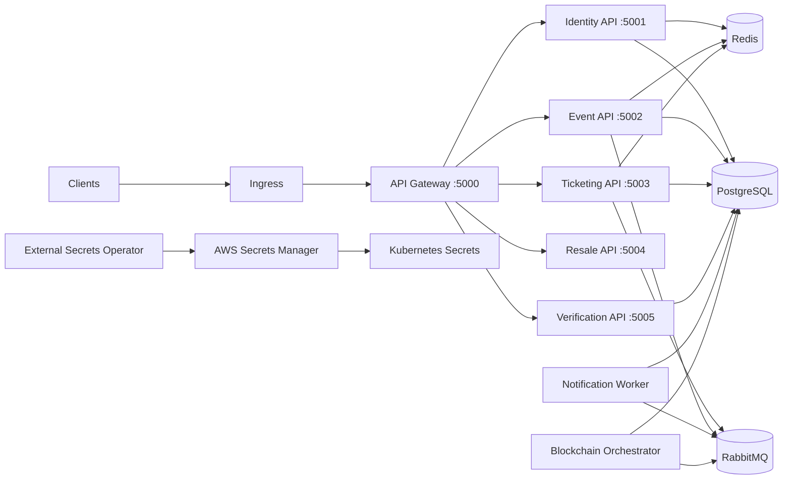

# BlockTicket

BlockTicket is a .NET 9 microservices backend for blockchain-based event ticketing — covering authentication, event management, ticket purchasing, NFT minting, resale, verification, and notifications. The platform includes Terraform on AWS, Kustomize overlays, External Secrets Operator, signed container images, ArgoCD GitOps, observability resources, and k6 load tests.

## Architecture



## Tech Stack

| Layer | Technology |
| --- | --- |
| Runtime | .NET 9.0 |
| API Gateway | YARP Reverse Proxy 2.1 |
| Auth | OpenIddict (OAuth2/OIDC) with reference tokens |
| ORM | Entity Framework Core 9.0 (Npgsql for PostgreSQL) |
| Caching | Redis 7 |
| Messaging | MassTransit 8.2 over RabbitMQ |
| Observability | OpenTelemetry (OTLP + Prometheus), Serilog |
| Container | Docker |
| Orchestration | Kubernetes (Kustomize), ArgoCD GitOps |
| IaC | Terraform (AWS EKS, RDS, ElastiCache, S3, DynamoDB) |
| CI/CD | GitHub Actions |
| Load Testing | k6 |

## Services

| Service | Port | Type | Database | Description |
| --- | --- | --- | --- | --- |
| API Gateway | 5000 | YARP Reverse Proxy | — | Entry point; routes, JWT validation, Swagger aggregation |
| Identity | 5001 | Web API | `BlockTicket_Identity` | Auth, user management, roles, MFA, sessions, OAuth2/OIDC |
| Event | 5002 | Web API | `BlockTicket_Event` | Event/venue/ticket-type management, pricing, seat maps, approvals |
| Ticketing | 5003 | Web API | `BlockTicket_Ticketing` | Reservations, checkout, payments, ticket lifecycle, resale, waiting list, refunds |
| Resale | 5004 | Web API | — (delegates to Ticketing) | Secondary ticket marketplace facade |
| Verification | 5005 | Web API | `BlockTicket_Verification` | Gate-entry scan validation and audit |
| Notification | — | Background Worker | `BlockTicket_Notification` | Purchase, mint, refund, security message delivery |
| Blockchain Orchestrator | — | Background Worker | `BlockTicket_Blockchain` | NFT mint/burn orchestration via smart contracts |

## Project Structure

```
src/
├── ApiGateway/                        # YARP reverse proxy
├── Services/
│   ├── Identity/
│   │   ├── Identity.API/              # Controllers, middleware, auth handlers
│   │   ├── Identity.Application/      # MediatR handlers, DTOs, validators
│   │   ├── Identity.Domain/           # User, Role, Permission, Session entities
│   │   └── Identity.Infrastructure/   # EF Core, repos, OpenIddict, security services
│   ├── Event/
│   │   ├── Event.API/                 # Controllers, rate limiting, ETag, idempotency
│   │   ├── Event.Application/         # Features/ (CQRS commands/queries), DTOs, validators
│   │   ├── Event.Domain/              # EventAggregate, Venue, TicketType, SeatMap, value objects
│   │   ├── Event.Infrastructure/      # EF Core, Redis caching, repos, messaging consumers
│   │   ├── Event.API.IntegrationTests/# WebApplicationFactory-based integration tests
│   │   └── Event.Tests.Integration/   # Security, pricing, RLS integration tests
│   ├── Ticketing/
│   │   ├── Controllers/               # Admin, analytics, refunds, resale, reservations, tickets, waiting list
│   │   ├── Ticketing.Application/     # Features/ (CQRS), DTOs, interfaces
│   │   ├── Ticketing.Domain/          # Reservation, Ticket, WaitingListEntry entities
│   │   ├── Ticketing.Infrastructure/  # EF Core, Redis locks, fake payment, messaging, expiry sweep
│   │   └── Ticketing.Tests/           # Workflow integration tests
│   ├── Resale/                        # Secondary marketplace API facade
│   ├── Verification/                  # Gate-entry scan API
│   ├── Notification/                  # MassTransit consumer worker
│   └── BlockchainOrchestrator/        # MassTransit mint/burn consumer worker
├── Shared/
│   ├── Common/                        # Base entities, Serilog, OTel, MassTransit extensions
│   └── Contracts/                     # Integration events & commands (MassTransit message schemas)
```

**Clean Architecture dependency flow:** API → Application → Domain. Infrastructure → Application + Domain. Domain has zero external dependencies.

## Key Architectural Patterns

- **CQRS via MediatR** — every operation is a Command or Query with a dedicated handler under `Features/{Entity}/Commands/` or `Features/{Entity}/Queries/`.
- **Domain events** — entities extend `BaseAuditableEntity` with `Id`, `CreatedAt`, `UpdatedAt`, and `AddDomainEvent()`.
- **Value objects** — `Money`, `Slug`, `TimeZoneId`, `GeoCoordinates`, `Email`, `WalletAddress`. Immutable record types.
- **Per-service database** — each service owns its own PostgreSQL database. No cross-service foreign keys.
- **API versioning** — URL-segment-based (`/api/v1/...`) with fallback to headers/query string.
- **Cursor pagination** — implemented in Event Service for large datasets.
- **ETag/conditional requests** — `ETagMiddleware` and `ITaggable` interface on domain entities.
- **Idempotency** — `IdempotentAttribute` and `IdempotencyKey` value object for safe retries.
- **Row-level security** — `RowLevelSecurityConfiguration` and `OrganizationAuthorizationFilter` for multi-tenant data isolation.
- **Inventory locking** — Redis-backed locks with local fallback, reservation expiry, and idempotent purchase flow.
- **Payment abstraction** — `IPaymentProvider` interface with a fake provider for local dev.

## Getting Started

### Prerequisites

- [.NET 9 SDK](https://dotnet.microsoft.com/download/dotnet/9.0)
- [Docker Desktop](https://www.docker.com/products/docker-desktop/)
- [k6](https://k6.io/) (optional, for load testing)

### Start Infrastructure

```bash
docker compose -f docker-compose.dev.yml up -d
```

This starts PostgreSQL (5432), Redis (6379), RabbitMQ (5672/15672), and MailHog (1025/8025).

### Build and Run Services

```bash
# Restore and build
dotnet restore
dotnet build

# Run each service in a separate terminal
dotnet run --project src/Services/Identity/Identity.API
dotnet run --project src/Services/Event/Event.API
dotnet run --project src/Services/Ticketing/Ticketing.Api.csproj
dotnet run --project src/Services/BlockchainOrchestrator/BlockchainOrchestrator.csproj
dotnet run --project src/Services/Notification/Notification.csproj
dotnet run --project src/Services/Verification/Verification.Api.csproj
dotnet run --project src/Services/Resale/Resale.Api.csproj
dotnet run --project src/ApiGateway
```

Startup automatically applies pending EF Core migrations (skipped in `Testing` environment). OpenIddict seed data runs on startup. Dev/Staging environments additionally seed permissions, roles, and users.

### Docker Compose (App Services)

```bash
# Start infrastructure + all app services
docker compose -f docker-compose.dev.yml --profile app up -d --build

# With monitoring (Prometheus + Grafana)
docker compose -f docker-compose.dev.yml --profile app --profile monitoring up -d --build
```

### Run Tests

```bash
# All tests
dotnet test

# Specific test project
dotnet test src/Services/Event/Event.API.IntegrationTests/Event.API.IntegrationTests.csproj
dotnet test src/Services/Ticketing/Ticketing.Tests/Ticketing.Tests.csproj
dotnet test src/Shared/Contracts.Tests/Shared.Contracts.Tests.csproj
```

## Infrastructure Ports

| Service | Port | Notes |
| --- | --- | --- |
| API Gateway (YARP) | 5000 | Main entry point |
| Identity Service | 5001 | OpenIddict OAuth2/OIDC server |
| Event Service | 5002 | Event & venue management |
| Ticketing Service | 5003 | Ticket purchase & reservations |
| Resale Service | 5004 | Secondary marketplace |
| Verification Service | 5005 | Gate-entry validation |
| PostgreSQL | 5432 | User: `postgres` / Pass: `postgres` |
| Redis | 6379 | Password: `redis_password` |
| RabbitMQ | 5672 | Management UI: 15672 (guest/guest) |
| MailHog | 1025 (SMTP) / 8025 (UI) | Email testing |
| Prometheus | 9090 | Metrics (monitoring profile) |
| Grafana | 3000 | Dashboards (monitoring profile) |

## Inter-Service Communication

- **Synchronous:** HTTP via YARP API Gateway. The gateway validates JWT tokens from Identity before forwarding.
- **Asynchronous:** MassTransit over RabbitMQ for domain → integration event publishing. `Shared.Contracts` defines message schemas.
- **Correlation IDs:** propagated through all service calls for distributed tracing.
- **Health checks:** every service exposes `/health`, `/health/ready`, and `/health/live` endpoints.

## Identity Service Auth Model

- **OpenIddict** is the OAuth2/OpenID Connect server with reference token support.
- Reference token authentication handler validates tokens at the gateway.
- Role-based access control: `RequireAdminRole` (admin, super_admin), `RequirePromoterRole` (promoter, admin, super_admin).
- Rate limiting policies per IP: `AuthPolicy` (10/min), `MfaPolicy` (5/min), `AdminPolicy` (100/min), `GatewayPolicy` (1000/min).
- Features: password history enforcement, concurrent session limits, MFA (TOTP, email OTP, WebAuthn), account lockout (5 failed attempts → 30 min lock), Discord-based security notifications.

## Event Service Middleware

Order matters (set in `Program.cs`):

1. Security middleware (`UseComprehensiveSecurity`)
2. Row-level security (`UseRowLevelSecurity`)
3. Serilog request logging
4. Global exception handler (`UseGlobalExceptionHandler`)
5. HSTS / HTTPS redirection
6. CORS
7. Auth pipeline

Custom middleware: `AdvancedRateLimitMiddleware`, `ETagMiddleware`, `GlobalExceptionHandlerMiddleware`, `PerformanceMonitoringMiddleware`.

## Environments

| Environment | Namespace | Terraform path | AWS region | Secrets source | DNS |
| --- | --- | --- | --- | --- | --- |
| dev | `blockticket-dev` | `infra/terraform/aws/environments/dev` | `ap-southeast-1` | local Kustomize secret generator | `dev.blockticket.example.com` |
| staging | `blockticket-staging` | `infra/terraform/aws/environments/staging` | `ap-southeast-1` | `blockticket-staging/app` in Secrets Manager | `staging.blockticket.example.com` |
| prod | `blockticket` | `infra/terraform/aws/environments/prod` | `ap-southeast-1` | `blockticket-prod/app` in Secrets Manager | `blockticket.example.com` |

## Deploy End to End

```bash
cd infra/terraform/aws/bootstrap
terraform init
terraform apply

cd ../environments/dev
../../scripts/init-backend.sh dev
terraform plan
terraform apply

aws eks update-kubeconfig --name blockticket-dev --region ap-southeast-1
kubectl apply -k ../../../k8s/overlays/dev
```

For staging and production, initialize `staging` or `prod`, install External Secrets Operator in the `external-secrets` namespace, then apply the matching overlay.

## CI/CD

Pull requests run `.github/workflows/pr-checks.yml`: gitleaks, Terraform format/validate, Checkov, Kustomize render smoke tests for dev/staging/prod, Dockerfile presence checks, and `dotnet format`.

Release builds run `.github/workflows/ci-cd.yml`: restore, NuGet audit, build, test, Docker build, Syft SBOM, Cosign keyless signing, Trivy SARIF upload, Cosign verification, then a GitOps promotion commit to `k8s/overlays/<env>/images/kustomization.yaml`. ArgoCD syncs the cluster from Git.

Promotion policy:

- `v*.*.*-rc*` deploys to staging.
- `v*.*.*` deploys to production.
- Manual dispatch supports controlled hot-fix deployment.

## GitOps

Install ArgoCD, then apply the app-of-apps resources:

```bash
kubectl apply -k k8s/gitops/argocd
```

Update `repoURL` in `k8s/gitops/argocd/*.yaml` from `replace-with-org` to the real repository before installing. Production sync is intentionally not automated by default; promote by tag, review the image-state commit, then sync or approve through ArgoCD.

Rollback policy:

- Preferred: revert the image promotion commit in `k8s/overlays/<env>/images/kustomization.yaml`.
- Emergency: run `.github/workflows/rollback.yml` to call `kubectl rollout undo`.

## Observability

Observability resources live under `k8s/addons/observability` and are intended to be synced by ArgoCD:

- kube-prometheus-stack Application for Prometheus, Alertmanager, and Grafana.
- Loki Application for logs.
- Tempo Application for traces.
- OpenTelemetry Collector for OTLP metrics/traces/logs ingestion.
- ServiceMonitor, PrometheusRule, Grafana datasource, and dashboard ConfigMaps.

SLOs are documented in `docs/sre/slos.md`; alert runbooks live in `docs/runbooks`.

## Load Testing

k6 scripts live in `tests/load` and can be run manually:

```bash
k6 run -e BASE_URL=https://staging.blockticket.example.com tests/load/k6-smoke.js
k6 run -e BASE_URL=https://staging.blockticket.example.com tests/load/k6-purchase-read-path.js
```

The same scripts are available through `.github/workflows/load-test.yml`.

## Secrets Flow

Terraform creates one AWS Secrets Manager secret per environment. External Secrets Operator authenticates with IRSA through the `external-secrets` service account and syncs selected properties into Kubernetes Secrets consumed by deployments. Dev uses overlay-local generated Secrets only for local development.

## Terraform

Remote state is bootstrapped from `infra/terraform/aws/bootstrap`, which creates an encrypted, versioned S3 bucket and DynamoDB lock table. Environment backends are initialized with `infra/terraform/aws/scripts/init-backend.sh` or `init-backend.ps1`.

More detail: `infra/terraform/aws/README.md`.

## Documentation

- Architecture decisions: `docs/adr/`
- Feature docs: `docs/features/` (rate limiting, ETag, idempotency, caching, seat maps, approval workflows, security notifications, cursor pagination, password history, concurrent sessions)
- DevOps: `docs/devops/`
- Runbooks: `docs/runbooks/`
- SRE: `docs/sre/`
- Kubernetes: `k8s/README.md`
