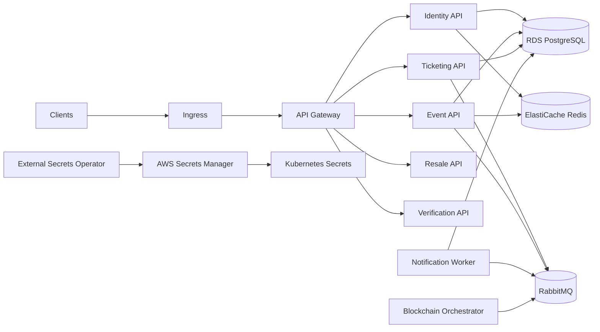

# BlockTicket

BlockTicket is a .NET 9 microservices backend for ticket sales, resale, verification, notifications, and blockchain mint orchestration. The platform now includes Terraform on AWS, Kustomize overlays, External Secrets Operator, signed container images, ArgoCD GitOps, observability resources, and k6 load tests.

## Architecture



## Environments

| Environment | Namespace | Terraform path | AWS region | Secrets source | DNS |
| --- | --- | --- | --- | --- | --- |
| dev | `blockticket-dev` | `infra/terraform/aws/environments/dev` | `ap-southeast-1` | local Kustomize secret generator | `dev.blockticket.example.com` |
| staging | `blockticket-staging` | `infra/terraform/aws/environments/staging` | `ap-southeast-1` | `blockticket-staging/app` in Secrets Manager | `staging.blockticket.example.com` |
| prod | `blockticket` | `infra/terraform/aws/environments/prod` | `ap-southeast-1` | `blockticket-prod/app` in Secrets Manager | `blockticket.example.com` |

## Deploy End To End

```bash
cd infra/terraform/aws/bootstrap
terraform init
terraform apply

cd ../environments/dev
../../scripts/init-backend.sh dev
terraform plan
terraform apply

aws eks update-kubeconfig --name blockticket-dev --region ap-southeast-1
kubectl apply -k ../../../k8s/overlays/dev
```

For staging and production, initialize `staging` or `prod`, install External Secrets Operator in the `external-secrets` namespace, then apply the matching overlay.

## CI/CD

Pull requests run `.github/workflows/pr-checks.yml`: gitleaks, Terraform format/validate, Checkov, Kustomize render smoke tests for dev/staging/prod, Dockerfile presence checks, and `dotnet format`.

Release builds run `.github/workflows/ci-cd.yml`: restore, NuGet audit, build, test, Docker build, Syft SBOM, Cosign keyless signing, Trivy SARIF upload, Cosign verification, then a GitOps promotion commit to `k8s/overlays/<env>/images/kustomization.yaml`. ArgoCD syncs the cluster from Git.

Promotion policy:

- `v*.*.*-rc*` deploys to staging.
- `v*.*.*` deploys to production.
- Manual dispatch supports controlled hot-fix deployment.

## GitOps

Install ArgoCD, then apply the app-of-apps resources:

```bash
kubectl apply -k k8s/gitops/argocd
```

Update `repoURL` in `k8s/gitops/argocd/*.yaml` from `replace-with-org` to the real repository before installing. Production sync is intentionally not automated by default; promote by tag, review the image-state commit, then sync or approve through ArgoCD.

Rollback policy:

- Preferred: revert the image promotion commit in `k8s/overlays/<env>/images/kustomization.yaml`.
- Emergency: run `.github/workflows/rollback.yml` to call `kubectl rollout undo`.

## Observability

Phase 3 observability resources live under `k8s/addons/observability` and are intended to be synced by ArgoCD:

- kube-prometheus-stack Application for Prometheus, Alertmanager, and Grafana.
- Loki Application for logs.
- Tempo Application for traces.
- OpenTelemetry Collector for OTLP metrics/traces/logs ingestion.
- ServiceMonitor, PrometheusRule, Grafana datasource, and dashboard ConfigMaps.

SLOs are documented in `docs/sre/slos.md`; alert runbooks live in `docs/runbooks`.

## Load Testing

k6 scripts live in `tests/load` and can be run manually:

```bash
k6 run -e BASE_URL=https://staging.blockticket.example.com tests/load/k6-smoke.js
k6 run -e BASE_URL=https://staging.blockticket.example.com tests/load/k6-purchase-read-path.js
```

The same scripts are available through `.github/workflows/load-test.yml`.

## Secrets Flow

Terraform creates one AWS Secrets Manager secret per environment. External Secrets Operator authenticates with IRSA through the `external-secrets` service account and syncs selected properties into Kubernetes Secrets consumed by deployments. Dev uses overlay-local generated Secrets only for local development.

## Terraform

Remote state is bootstrapped from `infra/terraform/aws/bootstrap`, which creates an encrypted, versioned S3 bucket and DynamoDB lock table. Environment backends are initialized with `infra/terraform/aws/scripts/init-backend.sh` or `init-backend.ps1`.

More detail: `infra/terraform/aws/README.md`.

## Decisions

Architecture decisions live in `docs/adr`.
